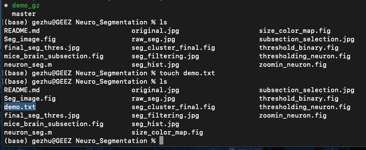

# GitRepo_Introduction
Introduction to lab code repo
by G Zhu

## Why GitHub version control?

Git version control allows users to keep track of collaborative work and identify code changes in the repository. We can share code/scripts, edit existing code, and run data visualization with the GitHub page. Google drive is good for document sharing. Github provides a better quality code repository. Also, there’s no geographic access restriction for Github. (You cannot access google product without a VPN from a certain Asian country)

Here are a few common commands for Github:

## Instructions

### Commit:
commit command to make selected files read to go up to the Github repository. 

### Pull:
Basically, the copy and paste commands in one. Pull the file from the GitHub repository to the local directory is a common command. 

### Push:
Once you commit your file and use the ‘push’ command, send it to the Github repository. 

### Branch: 
You can have multiple versions of the same project by different users. Each user has their own branch and can make modifications without disrupting the original file. 

### Merge:
Once you are ready to merge your edited file into the original file, you can use the merge command to combine your edited file and original file into one. 

For more GitHub commands: https://gist.github.com/jedmao/5053440 

Familiar yourself with basic Linux/UNIX terminal commands and shell scripting techniques are also helpful for GitHub. Github is one of the most common code version control/repository in the industry. 

### GitHub Pages

It is necessary if using GitHub Classroom to set up GitHub pages for the projecrs, as users do not have admin permissions on their repository. To do this, we need to create and move everything to the `gh-pages` branch and delete the `master` branch.

1. Commit the files to the `master` branch on GitHub.

1. `git branch gh-pages`

1. `git checkout gh-pages`

1. `git branch -D master`

1. `git push origin gh-pages`

1. On GitHub, go to `Settings`->`Branches` and set the default branch to `gh-pages`.

1. `git push origin :master`

### Template Repository

1. On GitHub, go to `Settings` and check the box for `Template repository` at the top. This makes GitHub page copies much faster.

## Quick Demo 
1. Git clone the project to your local machine:

2. Checkout all the file with "ls" command:

3. Create new branch with "git checkout" command:

4. Switch into your working branch from master branch:

5. Add files/edit the project:

6. Save your edit and push it to github repo:

